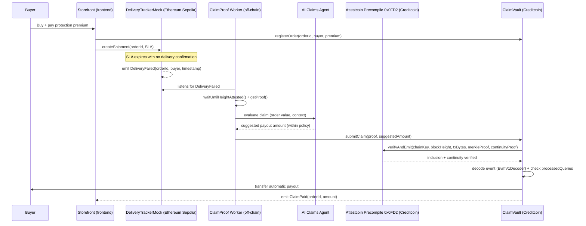

# Technical Architecture — ClaimProof

## Summary in one sentence

The user buys protection → the system detects an on-chain delivery failure → Attestcoin verifies the event is real → Creditcoin releases the payment, with the AI deciding only the amount, never the authorization.

## Sequence diagram

## Components

### Frontend (`frontend/`)

Next.js + wagmi/ethers v6 + WalletConnect. Two surfaces:

- **Storefront demo** — mock catalog, "delivery protection" purchase option, failure-simulation button (used in the live demo).
- **Dashboard** — real-time order status: `Active → Failure detected → Verifying proof → Paid`.

### Backend / Worker (`backend/`)

Go service (`cmd/worker` + `internal/`), three responsibilities:

1. **Listener** (`internal/listener`) — listens for the `DeliveryFailed` event from `DeliveryTrackerMock` via Sepolia's WSS RPC, using `go-ethereum`'s `ethclient`.
2. **Proof Builder** (`internal/proofbuilder`) — calls the Attestcoin Prover REST API directly (`https://prover.cc3-testnet.creditcoin.network`) to wait for attestation and obtain the Merkle inclusion + continuity proof for the `DeliveryFailed` transaction. There is no official Go SDK for Attestcoin — this package is a small hand-written HTTP client, since the official `@gluwa/usc-sdk` is TypeScript-only and is, itself, just a wrapper around this same REST API.
3. **AI Claims Agent** (`internal/claimsagent`) — receives the order context (value, history) and returns a suggested payout amount, always bounded by a policy cap configured in the contract (the AI never decides the final amount alone nor authorizes payment).

The worker (`internal/chain`, using `go-ethereum` + `abigen`-generated bindings) then calls `submitClaim(proof, suggestedAmount)` on `ClaimVault`.

### Smart contracts (`contracts/`)

| Contract | Chain | Role |
|---|---|---|
| `DeliveryTrackerMock.sol` | Ethereum Sepolia | Registers orders with a delivery SLA; emits `DeliveryFailed(orderId, buyer, timestamp)` when the SLA expires without confirmation. Team-controlled for the demo — removes dependency on a real logistics oracle. |
| `ClaimVault.sol` | Creditcoin CC3 | Holds protection premiums, maintains the payout pool, exposes `submitClaim(...)`. Internally calls `INativeQueryVerifier.verifyAndEmit()` on the native `0x0FD2` precompile, decodes the attested transaction via the `EvmV1Decoder` library, validates against `processedQueries` (anti-replay), and only then transfers the payout. |

### Creditcoin

Execution and settlement chain. Hosts `ClaimVault` and is where the Attestcoin Protocol precompile runs natively — there's no reason to reimplement verification on another L1.

### Attestcoin Protocol

Cross-chain verification layer (formerly "USC — Universal Smart Contracts"). It's the **only source of truth accepted** by `ClaimVault` to authorize a payment — no third-party data, price feed, or unverified text is accepted as a trigger. Full breakdown of usage in [docs/ATTESTCOIN_INTEGRATION.md](docs/ATTESTCOIN_INTEGRATION.md).

### Source chain

Ethereum Sepolia — the only source chain the Attestcoin Protocol currently supports (mainnet and Sepolia are the two chains listed in the official support table; the "any chain" marketing promise isn't real yet, see [docs/THREAT_MODEL.md](docs/THREAT_MODEL.md)).

### Indexer / Database

Lightweight cache (SQLite/Postgres) used only so the dashboard renders history quickly. **Never** the source of truth for a payout — every payment always goes through on-chain re-verification via Attestcoin.

### Wallet / Authentication

MetaMask or WalletConnect on both sides (Sepolia for `DeliveryTrackerMock`, Creditcoin testnet for `ClaimVault`). Authentication is purely wallet-based, with no proprietary identity backend.

## Transaction flow, step by step

1. The buyer completes the order and pays a protection premium into `ClaimVault` (Creditcoin).
2. The order is registered in `DeliveryTrackerMock` (Ethereum Sepolia) with a delivery SLA.
3. If the SLA expires with no delivery confirmation, the contract emits `DeliveryFailed`.
4. The worker detects the event, waits for finalization and attestation (`waitUntilHeightAttested`), and obtains the inclusion proof via the hosted Proof Builder.
5. The worker sends the proof and the raw transaction data to the AI Claims Agent, which analyzes the order context and proposes a payout amount within the configured policy.
6. The worker submits `submitClaim(...)` on `ClaimVault`, passing the proof.
7. `ClaimVault` calls the Attestcoin precompile (`0x0FD2`) to re-verify inclusion and continuity of the `DeliveryFailed` transaction — it only proceeds if verification returns success.
8. The contract decodes the relevant fields via `EvmV1Decoder`, checks `processedQueries` (anti-replay), and applies the AI-suggested amount within the policy cap.
9. The payout is transferred to the buyer; the `ClaimPaid` event is emitted on Creditcoin and the dashboard updates in real time.

## Cost and latency considerations

- Verification via Attestcoin completes in roughly **one Creditcoin block (~15s)** after the source event's attestation becomes available.
- The gas cost of verification **grows with proof age** — an event proven a few minutes after it occurred is orders of magnitude cheaper than one proven 24 hours later (more continuity hashes to walk). The worker should submit the claim as soon as possible after attestation becomes available.
- Proof batches are limited to 10 transactions per `getBatchProof` and a 1000-block range — not relevant for the MVP (one claim at a time), but relevant if the underwriting pool scales to process multiple claims simultaneously.

## Out of MVP scope

- **Attestcoin writability** (outbound messages from Creditcoin to another chain) — not production-ready per the protocol's own documentation.
- **Source chains beyond Ethereum/Sepolia** — not supported by the protocol today.
