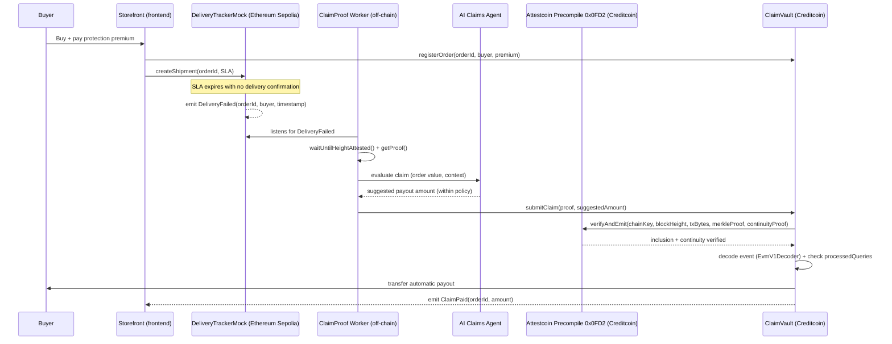

# ClaimProof

**A claim that pays itself — because the proof is faster than the adjuster.**

ClaimProof is a parametric insurance protocol for e-commerce/logistics built on **Creditcoin**, using the **Attestcoin Protocol** as the sole source of truth to authorize payments. An AI agent evaluates the claim and suggests the payout amount, but **never authorizes payment alone** — the contract only releases the amount after re-verifying on-chain, via Attestcoin, that the trigger event (delivery failure) actually happened on the source chain (Ethereum Sepolia).

Submitted to [BUIDL CTC 2026 Fall — BUIDL For The Real World](https://dorahacks.io/hackathon/buidl-ctc-2026-fall/detail), **AI** track.

---

## Why this exists

Traditional insurance claims depend on a human adjuster or a single trusted oracle to evaluate and authorize payment. It's slow, contestable, and opaque: whoever is waiting for the refund only has the platform's word. ClaimProof replaces that trust with cryptographic proof: the event that triggers the claim is a verifiable transaction on another chain, and the payout only goes out after that proof is checked on-chain.

## How it works



Full breakdown in [ARCHITECTURE.md](ARCHITECTURE.md). Specific Attestcoin Protocol usage (SDK/precompile functions exercised) in [docs/ATTESTCOIN_INTEGRATION.md](docs/ATTESTCOIN_INTEGRATION.md).

## Repository structure

```text
.
├── contracts/            # Solidity (Foundry) — DeliveryTrackerMock (Sepolia), ClaimVault (Creditcoin), deploy script
├── backend/               # Go worker (listener, proof builder, AI claims agent)
├── frontend/              # Next.js — storefront demo + claims dashboard
├── scripts/               # deployments.json (deployed addresses — data only)
├── demo/                  # Demo video link/script
├── docs/                  # Technical and product documentation
│   ├── ATTESTCOIN_INTEGRATION.md
│   ├── THREAT_MODEL.md
│   ├── TEAM.md
│   ├── SUBMISSION_COPY.md
│   ├── WHITEPAPER.md
│   ├── SPRINTS.md
│   ├── product.md
│   ├── architecture.md
│   ├── execution.md
│   ├── ideation.md
│   └── decision.md
├── ARCHITECTURE.md
├── SECURITY.md
└── README.md
```

## Project status

> Documentation and planning phase complete. Implementation in progress — see [docs/SPRINTS.md](docs/SPRINTS.md) for the sprint-by-sprint development plan through the submission deadline (2026-09-13, 23:59 ET).

## Running locally (reference — final commands will be confirmed during Sprint 1)

```bash
# Contracts
cd contracts
forge install
forge build
forge test

# Backend / worker
cd backend
go mod tidy
go run ./cmd/worker

# Frontend
cd frontend
npm install
npm run dev
```

Testnet deployment addresses (Sepolia + Creditcoin CC3) will be published in `scripts/deployments.json` once the final deploy happens (Sprint 5).

## Networks used

| Network | Role | Chain ID |
|---|---|---|
| Ethereum Sepolia | Source chain — emits the `DeliveryFailed` event | 11155111 |
| Creditcoin CC3 Testnet | Execution chain — `ClaimVault` + Attestcoin precompile | 102031 |

## Related documentation

- [ARCHITECTURE.md](ARCHITECTURE.md) — full technical architecture
- [SECURITY.md](SECURITY.md) — security posture and known limitations
- [docs/ATTESTCOIN_INTEGRATION.md](docs/ATTESTCOIN_INTEGRATION.md) — detailed Attestcoin Protocol usage
- [docs/THREAT_MODEL.md](docs/THREAT_MODEL.md) — threat model
- [docs/WHITEPAPER.md](docs/WHITEPAPER.md) — product whitepaper
- [docs/SPRINTS.md](docs/SPRINTS.md) — sprint-by-sprint development plan

## Team

See [docs/TEAM.md](docs/TEAM.md).

## License

MIT — see [LICENSE](LICENSE).
