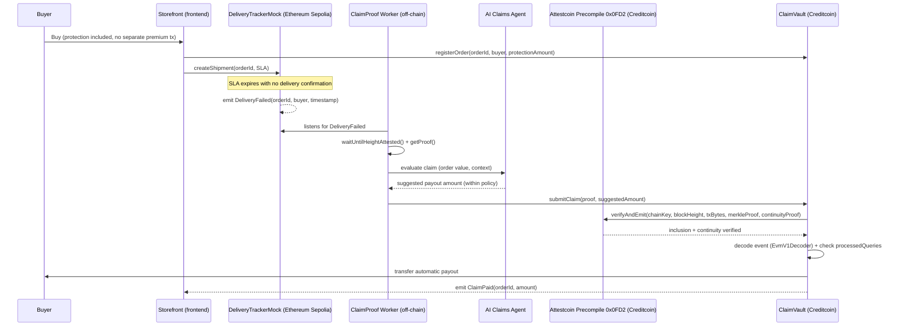

# ClaimProof

**A claim that pays itself — because the proof is faster than the adjuster.**

ClaimProof is a parametric insurance protocol for e-commerce/logistics built on **Creditcoin**, using the **Attestcoin Protocol** as the sole source of truth to authorize payments. An AI agent evaluates the claim and suggests the payout amount, but **never authorizes payment alone** — the contract only releases the amount after re-verifying on-chain, via Attestcoin, that the trigger event (delivery failure) actually happened on the source chain (Ethereum Sepolia).

Submitted to [BUIDL CTC 2026 Fall — BUIDL For The Real World](https://dorahacks.io/hackathon/buidl-ctc-2026-fall/detail), **AI** track.

---

## Why this exists

Traditional insurance claims depend on a human adjuster or a single trusted oracle to evaluate and authorize payment. It's slow, contestable, and opaque: whoever is waiting for the refund only has the platform's word. ClaimProof replaces that trust with cryptographic proof: the event that triggers the claim is a verifiable transaction on another chain, and the payout only goes out after that proof is checked on-chain.

## How it works



Full breakdown in [ARCHITECTURE.md](ARCHITECTURE.md). Specific Attestcoin Protocol usage (SDK/precompile functions exercised) in [docs/ATTESTCOIN_INTEGRATION.md](docs/ATTESTCOIN_INTEGRATION.md).

## Repository structure

```text
.
├── contracts/            # Solidity (Foundry) — DeliveryTrackerMock (Sepolia), ClaimVault (Creditcoin), deploy script
├── backend/               # Go worker (listener, proof builder, AI claims agent)
├── frontend/              # Next.js — storefront demo + claims dashboard
├── scripts/               # deployments.json (deployed addresses — data only)
├── demo/                  # Raw demo footage + notes (see demo/README.md)
├── docs/                  # Technical and product documentation
│   ├── ATTESTCOIN_INTEGRATION.md
│   ├── THREAT_MODEL.md
│   ├── TEAM.md
│   ├── SUBMISSION_COPY.md
│   ├── WHITEPAPER.md
│   ├── SPRINTS.md
│   ├── product.md
│   ├── architecture.md
│   ├── execution.md
│   ├── ideation.md
│   └── decision.md
├── ARCHITECTURE.md
├── SECURITY.md
├── docker-compose.yml     # runs backend (api + worker) and frontend together
└── README.md
```

## Project status

> Contracts, backend, and frontend implemented and deployed to testnet; the full flow (purchase → delivery failure → Attestcoin proof → AI-suggested payout → on-chain payout) has been run successfully live, repeatedly. See [docs/SPRINTS.md](docs/SPRINTS.md) for the sprint-by-sprint development plan through the submission deadline (2026-09-13, 23:59 ET) and current progress.

## Running the app (Docker — backend + frontend)

The contracts are already deployed to testnet (see [`scripts/deployments.json`](scripts/deployments.json)) — running the app means running `cmd/api`, `cmd/worker`, and the frontend against those already-live contracts. Docker runs all three with one command; you don't need Go, Node, or Foundry installed to do this.

You'll need:
- A dedicated **testnet-only** wallet private key, funded with [Sepolia ETH](https://www.alchemy.com/faucets/ethereum-sepolia) and [Creditcoin CC3 testnet CTC](https://creditcoin.org/faucet/) — never a personal or mainnet key.
- An API key for one supported LLM provider (Gemini, OpenAI, or Anthropic) for the AI claims agent.
- The deployed contract addresses from [`scripts/deployments.json`](scripts/deployments.json) — the single source of truth for `DELIVERY_TRACKER_MOCK_ADDRESS` / `CLAIM_VAULT_ADDRESS` (Sepolia / Creditcoin sections respectively).

```bash
cp .env.example .env
# Edit .env: paste the addresses from scripts/deployments.json, your RPC URLs,
# your testnet private key, and your LLM API key.
docker compose up --build
```

Starts `cmd/api` (:8080), `cmd/worker`, and the frontend (:3000) together — open http://localhost:3000. Backend images are multi-stage builds on `distroless/static`; the frontend uses Next.js's standalone output — see `docker-compose.yml` and each service's `Dockerfile`.

Connect a wallet holding testnet CTC/ETH (or any address — only the backend key ever signs transactions) and buy protection. Full end-to-end timing note: after a delivery failure is reported, `cmd/worker` typically takes 5-10 minutes to reach a payout, waiting on Attestcoin's attestation — this is normal, not a hang (see [docs/ATTESTCOIN_INTEGRATION.md](docs/ATTESTCOIN_INTEGRATION.md)).

### Per-service, without Docker (for active development on the app)

Same env vars as above, split across each service's own `.env`/`.env.local`:

```bash
# Backend — both must run together for the full flow:
# cmd/api registers new orders (the Store's buy button calls it);
# cmd/worker watches for failures and drives them to payout.
cd backend
cp .env.example .env   # fill in as described above
go mod tidy
go run ./cmd/api      # in one terminal
go run ./cmd/worker   # in another

# Frontend
cd frontend
cp .env.example .env.local   # fill in the same contract addresses (NEXT_PUBLIC_ prefixed)
npm install
npm run dev
```

### Working with the contracts (Foundry)

Only needed if you want to change, test, or redeploy the contracts themselves — not required to run the app against the already-deployed testnet contracts above.

```bash
cd contracts
forge install
forge build
forge test
```

## Networks used

| Network | Role | Chain ID |
|---|---|---|
| Ethereum Sepolia | Source chain — emits the `DeliveryFailed` event | 11155111 |
| Creditcoin CC3 Testnet | Execution chain — `ClaimVault` + Attestcoin precompile | 102031 |

## Related documentation

- [ARCHITECTURE.md](ARCHITECTURE.md) — full technical architecture
- [SECURITY.md](SECURITY.md) — security posture and known limitations
- [docs/ATTESTCOIN_INTEGRATION.md](docs/ATTESTCOIN_INTEGRATION.md) — detailed Attestcoin Protocol usage
- [docs/THREAT_MODEL.md](docs/THREAT_MODEL.md) — threat model
- [docs/WHITEPAPER.md](docs/WHITEPAPER.md) — product whitepaper ([PDF export](docs/ClaimProof-Whitepaper.pdf))
- [docs/SPRINTS.md](docs/SPRINTS.md) — sprint-by-sprint development plan

## Team

See [docs/TEAM.md](docs/TEAM.md).

## License

MIT — see [LICENSE](LICENSE).
