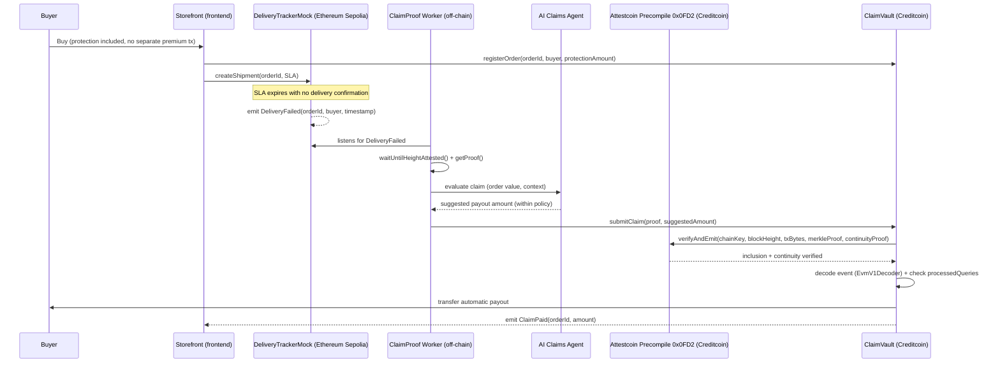

# ClaimProof — Technical Architecture & MVP

> Phase 3. Complements [product.md](product.md).

**Flow in one sentence:** the user buys protection → the system detects an on-chain delivery failure → Attestcoin verifies the event is real → Creditcoin releases the payment, with the AI deciding only the amount, never the authorization.

## Sequence diagram

## Components

| Component | Responsibility |
|---|---|
| **Frontend** | Next.js + wagmi + viem, WalletConnect. Storefront demo (purchase + protection) and claims dashboard with live status. |
| **Backend — `cmd/api`** | Go. The Store's operator service: signs `registerOrder`/`createShipment` on the buyer's behalf, since both are worker-gated (see T8). The buyer's wallet only identifies the payout address. |
| **Backend — `cmd/worker`** | Go (`internal/`). Listens for `DeliveryFailed` on Sepolia, obtains the proof by calling the Attestcoin Prover REST API directly (no official Go SDK), consults the AI Claims Agent, submits `submitClaim` on Creditcoin via `go-ethereum`. |
| **Smart contracts** | `DeliveryTrackerMock.sol` (Sepolia) emits the trigger event. `ClaimVault.sol` (Creditcoin) holds the pool, calls `INativeQueryVerifier.verifyAndEmit()` on the `0x0FD2` precompile, decodes via `EvmV1Decoder`, checks `processedQueries` (anti-replay), and pays out. |
| **Creditcoin** | Execution and payment chain — hosts `ClaimVault` and the Attestcoin precompile. |
| **Attestcoin** | Cross-chain verification layer — the only source of truth accepted to authorize a payout. |
| **Source chain** | Ethereum Sepolia — the only chain Attestcoin supports as a source today. `DeliveryTrackerMock` is team-controlled, removing dependency on a real logistics oracle for the demo. |
| **Indexer / Database** | No database — the dashboard reads both chains directly on every poll. Tracked orders live in browser `localStorage`; the AI's reasoning lives in `cmd/api`'s in-memory store. Never the source of truth for a payout either way. |
| **Wallet / Auth** | MetaMask/WalletConnect; wallet-based authentication only. In practice the buyer's wallet only signs on Sepolia (the demo's failure-simulation button) — every `ClaimVault` write is signed by the backend's worker key. |

## MVP scope

### MUST HAVE

- `DeliveryTrackerMock` deployed on Sepolia with a failure-reporting function
- `ClaimVault` on the Creditcoin testnet with **real** integration to the Attestcoin precompile (no mock in the verification path)
- Functional E2E flow: purchase → simulated failure → proof → payout
- Off-chain worker connecting both sides
- Foundry tests covering replay protection, verification failure, correct payout
- Minimal frontend with live status
- README + technical doc on Attestcoin usage (required by submission)
- Demo video

### SHOULD HAVE

- Real AI evaluating claim value based on rules + order context
- Underwriting pool with multiple capital providers
- Dashboard with claim history and risk metrics
- A second trigger scenario in the demo (reinforces the architecture's generality)

### NICE TO HAVE

- A third trigger-event type (e.g., simulated flight delay)
- Independent verification / a second simulation model (`Cr3dX`-style)
- Full public threat model (`crosscredit`-style)

### DO NOT DO

- Attestcoin writability — not production-ready
- Support for chains beyond Ethereum/Sepolia
- A full compliance/KYC system
- A custom token / complex tokenomics
- Over-polishing the UI at the expense of the real E2E flow
